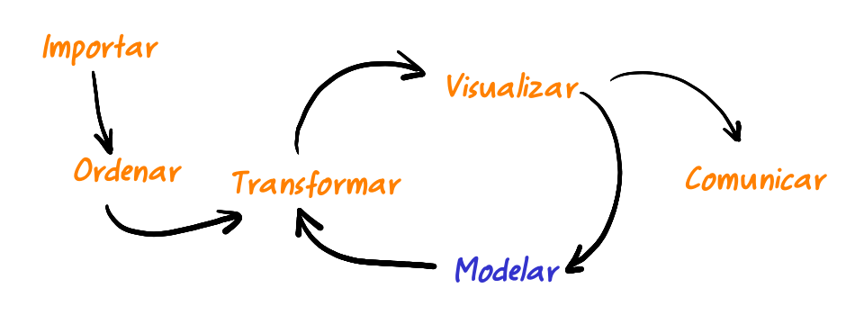

```{r setup, include=FALSE}
knitr::opts_chunk$set(echo = TRUE, comment = NA)
library(summarytools)

```


</br></br>

```{r, echo=FALSE, out.width="100%", fig.align = "center"}
knitr::include_graphics("img/banner_presentacion.png")
```
</br></br>

La **modelación** forma parte principal del proceso de análisis de datos y permite avanzar hacia la toma de decisiones infomadas 


```{r, echo=FALSE, out.width="80%", fig.align = "center"}

```

<center>
Proceso de Datos
</br>
<sub>
Tomado de : Ciencias de Datos para Gente Sociable
</sub>
</center>

</br></br>

Dependiendo el problema a ser abordado, se utiliza una herramienta estadística diferente para el proceso de modelación. Dentro de los modelos más utilizados se destacan: 
el análisis de componentes principales, análisis de correspondencia, análisis discriminante, como parte de una herramientas estadiísticas que permiten el resumen de información, la clasificación de individuos y variables y la visualización de patrones.

Para pronosticar y valorar la relación existente entre una variable y un grupo de variables se tienen los modelos de Regresión Lineal, la Regresión Logistica, el Modelo Lineal Generalizado, el Modelo Lineal Mixto Generalizado, el modelo de Regresión de Cox y el modelo de series de tiempo, entre otros.


</br>

En esta primera unidad empezaremos con los modelos clasificados como descriptivos

