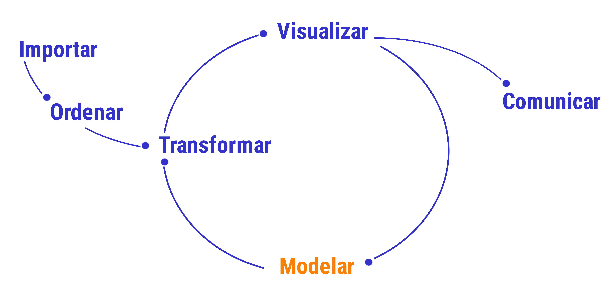

```{r setup, include=FALSE}
knitr::opts_chunk$set(echo = TRUE, comment = NA)
library(summarytools)

```


</br></br>

```{r, echo=FALSE, out.width="100%", fig.align = "center"}
knitr::include_graphics("img/banner_presentacion.png")
```
</br></br>

La **modelación** forma parte principal del proceso de análisis de datos y permite avanzar hacia la toma de decisiones infomadas 

<br/>

```{r, echo=FALSE, out.width="80%", fig.align = "center"}

```

<center>
Proceso de Datos
</br>
<sub>
Tomado de : Ciencias de Datos para Gente Sociable
</sub>
</center>

</br></br>

Dependiendo el problema a ser abordado, se utiliza una herramienta estadística diferente para el proceso de modelación. 

Estos modelos permiten explorar tanto relaciones entre variables como entre individuos y la identificación  patrones entre multiples variables de manera simultanea.

Dentro de los modelos más utilizados se destacan: 

* Análisis de componentes principales, 
* Análisis de correspondencia, 
* Análisis discriminante,
* Análisis factorial 
* Análisis de correlación canónica


Para pronosticar y valorar la relación existente entre una variable y un grupo de variables algunos de los modelos  más utilizados son: 

* Regresión Lineal, 
* Regresión Logistica, 
* Modelo Lineal Generalizado, 
* Modelo Lineal Mixto Generalizado, 
* Regresión de Cox 
* Series de tiempo

<br/>

Dentro de las aplicaciones más destacadas estan :

<br/>

### <span style="color:#034a94">**Segmentación de Clientes**</span> 

En marketing, los métodos multivariados pueden ayudar a segmentar clientes en grupos homogéneos para adaptar estrategias de marketing específicas.

  * compradores y no compradores
  * cumplidos y morosos
  * enfermo / sano
  * culpable/ inocente
  * cliente fiel / deserta
  * identificar que factores inciden sobre una variable de interés

<br/><br/>

### <span style="color:#034a94">**Análisis de Sentimiento**</span> 

En procesamiento de lenguaje natural, los métodos multivariados pueden analizar simultáneamente varias características lingüísticas para comprender el sentimiento en el texto.

  * favorables / no favorables
  * amor / odio
  * identificación de patrones de combinación de palabras
  
<br/><br/>

### <span style="color:#034a94">**Biología y Genómica**</span> 

Para analizar conjuntos de datos biológicos que pueden contener información de múltiples genes y características.

* determinación de una nueva especie
* clasificación de individuos

<br/><br/>

### <span style="color:#034a94">**Finanzas**</span> 

Para evaluar riesgos y rendimientos en carteras de inversiones que involucran múltiples instrumentos financieros.

* estimación o pronosticar del valor de un documento financiero
* estimación del riesgo de inversión

<br/><br/>

### <span style="color:#034a94">**Imagen y Reconocimiento de Patrones**</span> 

En procesamiento de imágenes, los métodos multivariados pueden extraer características y patrones a partir de imágenes complejas.


</br><br/>

En esta primera unidad empezaremos con los modelos clasificados como descriptivos : El **análisis de componentes principales**, **análisis de correspondencia**, **análisis discriminante** y posteriormente trataremos los **modelo de regresión lineal** y el **modelo lineal general** y la **regresión logistica**.

</br></br>

Contenido de la unidad

</br>

* **Conceptos generales**
  * Conceptos básicos
  * Tablas de contingencia
  * Matrices de Varianza-Covarianza y de Correlaciones

</br>

* **Análisis de Componentes Principales**
  * Conceptos
  * Ejemplo

</br>

* **Análisis de Conglomerados**
  * Conceptos
  * Ejemplo

</br>

* **Análisis de Correspondencia**
  * Conceptos
  * Ejemplo


</br></br>