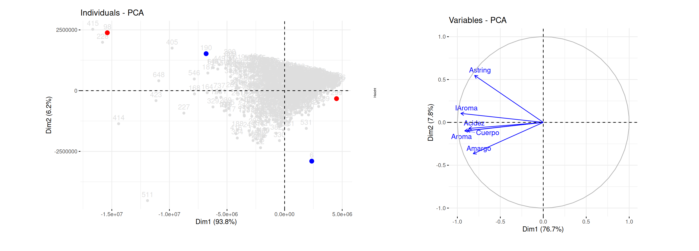

```{r setup, include=FALSE}
knitr::opts_chunk$set(echo = TRUE, comment = NA)

library(psych)
library(summarytools)
# colores
c1="#FF7F00"
c2="#=EB0C6"
c3="#034A94"
c4="#686868"
c5=c1

# devtools::install_github("kassambara/factoextra") # ultima version
library("factoextra") # visualizacion elegante en ggplot2
par(mar = c(1,1,1,1) + 0.1)

set.seed(321)
data("vivienda")
ids <-sample(1:8322, 1000)
vivienda1 <-vivienda[ids,]

```

<br/><br/>


Por los general en el aprendizaje de las Estadística se trabaja con datos en una sola dimensión (univariado), se revisan tando indicadores como la representación gráfica de las variables una a una. En ocaciones se pasa a estudiar grupos de variables de manera bivariada. Para ello se construyen tablas cruzadas y se grafican las dos variables en un plano de tal forma que permite identificar relacines entre ellas.  

En esta unidad trataremos el caso multivariado que consiste en tomar la información contenida en un grupo de variables  (m>2) que permita dar valor a un conjunto de variables y registros, pudiendo identificar patrones y realizar agrupaciones.

Para hacernos una idea empesaremos lo univariado a lo multivariado

<br/><br/>

## <span style="color:#034a94">**Análisis estadístico univariado**</span>

Supongamos que tenemos información de un grupo de 1000 viviendas de las cuales contamos con su valor comercial. A partir de esta información podemos realizar un **análisis univariado** como se presentó en el curso anterior, mostrandonos de manera parcial el comportamiento de los precios de las viviendas.

<br/>


:::: {style="display: flex;"}
::: {}

<!-- ```{r, echo=FALSE} -->
<!-- summarytools::descr(vivienda1$preciom) -->

<!-- ``` -->


<pre>


Descriptive Statistics  
vivienda1$preciom  
N: 1000  

                    preciom
----------------- ---------
             Mean    457.38
          Std.Dev    348.37
              Min     65.00
               Q1    220.00
           Median    340.00
               Q3    580.00
              Max   1950.00
              MAD    237.22
              IQR    360.00
               CV      0.76
         Skewness      1.67
      SE.Skewness      0.08
         Kurtosis      2.72
          N.Valid   1000.00
        Pct.Valid    100.00

</pre>

:::

::: {}

:::
```{r,echo=FALSE, fig.align='center', fig.width=4.5, fig.height=6}

boxplot(vivienda1$preciom, horizontal=FALSE, las=1, col = "#FF7F00")
```

:::


Es posible que este análisis se quede corto para entender el comportamiento de los precios de la vivienda, su alta variación y asimetria.

<br/><br/>


## <span style="color:#034a94">**Análisis estadístico bivariado**</span>

Una segunda opción es la de analizar dos variables al tiempo (**análisis bivariado**) y medir la relación que puede existir entre ellas, presentandose las siguientes posibiblidades:

<br/>

### <span style="color:#FF7F00">**1. cualitativa - cualitativa**</span> : 

En este caso se emplean las tablas de contingencia o de doble entrada, las cuales se pueden representar mediante un diagrama de barras. Para determinar si existe relación o no entre las dos variables se utiliza una prueba de hipotesis Chi-cuadrado para tablas de contingencia.

:::: {style="display: flex;"}
::: {}

```{r, echo=FALSE}
tabla <-table(vivienda1$tipo, vivienda1$zona)
t(tabla)
```

:::
::: {}
:::

```{r, echo=FALSE, fig.align='center', fig.width=6}
barplot(tabla, 
        main = "Tipo de vivienda por Zona",
        las = 1,
        col = c("#FF7F00", "#034A94"), 
        ylim = c(0,600),
        names.arg=c("Centro","Norte","Oeste","Oriente", "Sur") 
        )
# legend("topleft", legend = rownames(tabla))
```

::::

<br/>

```{r, echo=FALSE, warning=FALSE, message=FALSE}
chisq.test(tabla)
```

El resultado obtenido (p-value: 0.000), indica que las variables no son independientes

<br/><br/>

### <span style="color:#FF7F00">**2. cualitativa - cuantitativa**</span>: 

<!-- ```{r, echo=FALSE, warning=FALSE, message=FALSE} -->
<!-- library(psych) -->
<!-- psych::describe.by(vivienda1$preciom,vivienda1$tipo) -->
<!-- ``` -->

En este caso se puede realizar un análisis calculando los indicadores estadisticos (media, mediana, varianza...) de la variable cuantitavica para los diferentes grupos o categorías que conforman la variable cualitativa. Y tambien representarlas mediante un diagrama de cajas. 


<pre>
Descriptive statistics by group 
</pre>

<pre>
group: Apartamento
vars     n    mean     sd        median  trimmed   mad     min      max   range   skew  kurtosis  se
precio   611  384.51   312.28    290     321.24    185.32  65       1950  1885    2.08  4.67      12.63 
</pre>

<pre>
group: Casa
vars     n    mean     sd        median  trimmed   mad     min      max   range   skew  kurtosis  se
precio  389   571.82   371.03    470     518.36    281.69  80       1900  1820    1.32  1.44      18.81

</pre>


```{r, echo=FALSE, fig.align='center', fig.width=6, fig.height=8}
boxplot(vivienda1$preciom ~ vivienda1$tipo,
        ylab = "precio de la vivienda (MM$)",
        xlab = "tipo de vivienda",
        las=1, 
        col = c(c1,c4))
```

Los resultados muestra una leve diferencia entre los dos grupos en cuanto a su media que puede ser confirmada mediante una prueba de hipotesis t.student para la comparación de medias

```{r, echo=FALSE}
t.test(vivienda1$preciom ~ vivienda1$tipo)
```

Los resultados indican que existen diferencias significativas entre los valores medios de las casas comparados con los valores medios de los apartamento

<br/><br/>

### <span style="color:#FF7F00">**3. cuantitativa - cuantitativa**</span> : 


Cuando tenemos dos variables cuantitavivas se pueden medir indicadores conjuntos como son la covarianza y la correlación, esta última mide la fuerza de la relación lineal entre las dos variables. 


```{r, echo=FALSE}
cat("Cov(precio, area construida) = ",cov(vivienda1$preciom, vivienda1$areaconst))
```

```{r, echo=FALSE}
cat("Cor(precio, area construida) = ",cor(vivienda1$preciom, vivienda1$areaconst))
```

Los resultados indican una leve relación  lineal positiva entre el área construida de la vivienda y su valor comercial (a mayor área de construcción de la vivienda, mayor pecio).

```{r, echo=FALSE, fig.align='center'}
plot(vivienda1$preciom, vivienda1$areaconst, las=1,
     pch=19, col = c1, 
     ylab = "area construida de la vivienda",
     xlab = "precio de la vivienda (MM$)")
```


<br/><br/>


## <span style="color:#034a94">**Análisis estadístico multivariado**</span>

<br/>

Aunque este analisis es más amplio que los anteriores está menos difundido y utilizado que los dos anteriores 

Los metodos multivariados pueden tener diferentes propositos como: 

<br/>

* **resumir un conjunto datos con muchas variables en unas pocas** :  Análisis de Componentes Principales
  
<br/>

* **visualizar patrones** - **clasificar** :  Análisis de Conglomerados, 

<br/>

* **realizar predicciones** :  Regresión Lineal

<br/>

* **asociación entre variables** : Análisis de Correspondencia


<br/><br/><br/>

<br/> <br/>
```{r, echo=FALSE, out.width="110%", fig.align='center'}

```


En esta unidad se tratan algunos de estos métodos


 
 
 
 