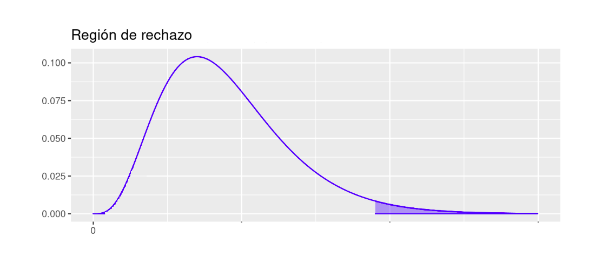

```{r setup, include=FALSE}
knitr::opts_chunk$set(echo = TRUE)
```

<br/><br/>

Estan conformadas por un arreglo de datos correspondientes a las frecuencias absolutas que resultan al contar las todas las posibles registros que contienen las caracteristicas  ($a_i,b_j$) correspondientes a las dos variables que son representadas por $n_{ij}$

<br/><br/>

<center>
{width=50%}
</center>

<br/><br/>

Los valores $n_{i.}$ represdentan el total marginal de la variable `A`, mientras que $n_{.j}$ representa el total por columnas que corresponden a la variable `B`. La suma de todos los valores $n_{ij}$ es $n$ 

La función `table()` en `R` permite contruir la tabla a partir de la información contenida en una base de datos (`table(data$A, data$B)`)

<br/><br/>

# <span style="color:#034a94">**Prueba chi-cuadrado de Pearson**</span>  

<br/>

Determina si las diferencias entre las frecuencias observadas en una tabla de contingencia y las frecuencias esperadas, suponiendo que las variables son independientes, son estadísticamente significativas. En caso de rechazarse Ho, se concluye que las variables son independientes, en caso contrario se asume que hay una relación entre ellas (dependencia).


<br/><br/>

**Pruebas** :

$$H_{o} : \text{la variables A es independiente de la variable B} \hspace{.8cm}$$ 
$$H_{o} : \text{la variables A es NO independiente de la variable B}$$

<br/>

**Estadístico de prueba**: 

$$\chi^{2} = \dfrac{\sum (Obs -Esp)^2}{Esp} \sim \chi^{2}_{v:(r-1)(c-1)}$$

<br/><br/>

**Región de rechazo**:

```{r, eval=FALSE, echo=FALSE}
library(ggdistribute)
pRdeR=qchisq(c(0.025,0.975),9)
p=ggdistribution(dchisq, seq(0, 30, 0.1), df = 9, colour = 'blue')
p=ggdistribution(dchisq, seq(pRdeR[2], 30, 0.1), df = 9, colour = 'blue', fill="blue", p=p)+
       ggtitle("Región de rechazo:   (19.0, Inf) ")
p
pRdeR
```


```{r, echo=FALSE, out.width="60%", fig.align = "center"}

```


<br/><br/>