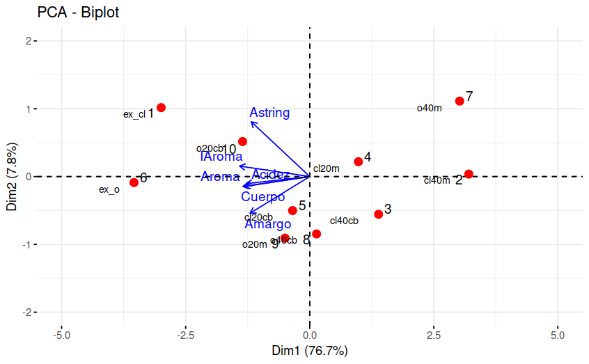

```{r setup, include=FALSE}
knitr::opts_chunk$set(echo = TRUE, comment = NA)

# colores
c1="#FF7F00"
c2="#=EB0C6"
c3="#034A94"
c4="#686868"

# devtools::install_github("kassambara/factoextra") # ultima version
library("factoextra") # visualizacion elegante en ggplot2
par(mar = c(1,1,1,1) + 0.1)
```

</br></br>


# **Conceptos**
</br></br>

# <span style="color:#034a94">**Introducción**</span>

</br>

Este análisis consiste en describir la variación producida por las observaciones de $p$ variables aleatorias, mediante un conjunto de nuevas variables que estan correlacionadas entre si, denominadas **componentes** y que estan conformadas por combinación lineal de las variables originales. 

Se utiliza como complemento de los análisis descriptivos y para contribución en modelos predictivos, reduciendo el número de variables empleadas en el modelo.

Las nuevas variables se obtienen en orden de contribución a la variabilidad total de los datos, tal forma que el primer componente describe la mayor cantidad de la variación total del conjunto de variables originales. El segundo componente principal se elige de tal forma que explique la mayor cantidad de la variación total del conjunto de datos que resta sin explicar por el primer componente, bajo la condición de ser independiente de la primera componente y así sucesivamente.

</br></br>La matriz de datos: es una matriz de $n \times p$ que contiene los datos originales, donde $n$ es el número de observaciones y $p$ es el número de variables.

La matriz de covarianza: es una matriz cuadrada de $p \times  p$ que muestra la relación entre las diferentes variables del conjunto de datos.

Los autovalores y autovectores: son los componentes principales del análisis y se utilizan para transformar los datos originales en un nuevo conjunto de datos que contiene menos variables.

La varianza explicada: indica la cantidad de varianza en los datos originales que es explicada por cada componente principal.

La carga de las variables: indica la contribución de cada variable a cada componente principal.

El gráfico de dispersión: es una representación visual de los datos transformados en el nuevo espacio de componentes principales. Este gráfico permite identificar patrones o agrupaciones en los datos que pueden no haber sido evidentes en el espacio original de las variables.

Las componente se pueden representar por $CP1$, $CP2$, $CP3$ $\dots$ construidas a partir de un conjunto de $p$ variables, de forma que:


$$V[CP_1] > V[CP_2] > V[CP_3] > \dots > V[CP_p]$$
y  $Cor[CP_i, CP_j] = 0$ para todo para de componentes $i \neq j$

</br></br>

El objetivo principal del ACP es poder ver si las dos o tres primeras componentes explican la mayor parte de la variación de las $p$ variables iniciales. Si es así se pueden considerar estas dos componentes, reduciendo la dimensión de los datos y considerar su representación gráfica.

</br></br>

<div class="content-box-gray">
### <span style="color:#686868">**Nota**</span> 

Los procedimientos anteriores están soportados en el supuesto de que las $p$ variables son una combinación lineal de un base que se desea encontrar.

</div>


## <span style="color:#034a94">**Principales conceptos**</span>

<br/>

### <span style="color:#034a94">**Matriz de datos**</span>

Los datos conforman una matriz de dimensión $n \times p$ que contiene los datos originales, donde $n$ corresponde al número de observaciones y $p$ el número de variables.

<br/>

### <span style="color:#034a94">**Matriz de covarianza- covarianzas**</span>

Matriz cuadrada de dimensión $p \times p$ que contiene las covarianzas entre pares de variables  $Cov[X_i,X_j]$ y su diagonal está conformada por las varianza de las variables $V[X_i]$ 

<br/>

### <span style="color:#034a94">**Autovalores y autovectores**</span>

A parir de la matriz de varianza covarianzas son calculados sus valores propios que representan la cantidad de la varianza de la data explicada por cada componente principal, mientras que los vectores propios de la misma matriz, indica la dirección y fuerza de la relación entre las variables y la de los componentes principales.

<br/>

### <span style="color:#034a94">**Varianza explicada**</span>

Indica la cantidad de varianza de los datos  que es explicada por cada componente principal.

<br/>

### <span style="color:#034a94">**Carga de las variables**</span>

Indica la contribución de cada variable a cada componente principal. Dependiendo su valor puede sugerir un nombre para el componente que facilite la interpretación de los resultados obtenidos.

<br/>

### <span style="color:#034a94">**Gráfico de dispersión**</span>

Representación visual de los datos transformados (componentes principales) en un nuevo espacio por lo general de $R^2$. Este gráfico permite identificar patrones o agrupaciones en los datos que pueden no haber sido evidentes en el espacio original de las variables.


</br></br>

## <span style="color:#034a94">**Determinación de los componentes**</span>

<br/>

El primer componente tiene la forma :

$$CP_{1}  = \beta_{11}X_1+ \beta_{12}X_2 + \dots + \beta_{1p}X_{p} = \displaystyle\sum_{i=1}^{p} \beta_{1i} X_{i} = b'_{1}X$$
</br>

Donde $b'= (\beta_{11}, \beta_{12}, \dots , \beta_{1p})$ es el vector de coeficientes a estimar y $X'$ el vector de variables $(X_1, X_2, \dots, X_p)$ que conforma la data.

Para determinar la porción de la varianza total de la data explicada por el componente se define $\Sigma$ matriz de Varianzas-covarianzas  

</br></br>

$$
\Sigma =
\begin{equation}
\left(
\begin{array}{cccc}
\sigma^2_1 & \sigma_{12} & \cdots & \sigma_{1p} \\
\sigma_{21} & \sigma^2_2 & \cdots & \sigma_{2p} \\
\vdots & \vdots & \ddots & \vdots \\
\sigma_{p1} & \sigma_{2p} & \cdots & \sigma^2_p
\end{array}
\right)
\end{equation}
$$

</br></br>

Enconces la varianza del primer componente será :

$$V[CP_1] = V[b'_1 X] = b'_1 \hspace{.1cm}\Sigma \hspace{.1cm} b_1$$
</br>

Bajo la restricción :

$$\beta_{11}^2  + \beta_{12}^2 + \dots + \beta_{1p} = b'_1 \hspace{.1cm}b_1= 1$$

</br>

La solución a este sistema se obtiene  mediante el método matemático Multiplicadores de Lagrange que maximiza el valor $\lambda_1$ para la siguiente función :

$$b'_1 \hspace{.1cm}\Sigma \hspace{.1cm}b_1 - \lambda_1 (b'_1 \hspace{.1cm} b_1-1) $$

</br>

Dando como resultados:

$$CP_1 = b'_1 X$$
</br>

El segundo componenete estará determinado por una segunda ecuación de Lagrange con la que se obtiene:


$$CP_2 = b'_2X$$

</br>

La varianza total de las $p$

$$\displaystyle\sum_{i=1}^p V[X_i] = \sum_{i=1}^p V[CP_i] = \displaystyle\sum_{i=1}^p \lambda_{i}$$
</br>

De tal forma que la contribución total por cada componente se estimará como:


$$\dfrac{\lambda_{i}}{\displaystyle\sum_{i=1}^p \lambda_{i}}$$


</br>

Ahora, la contribución de los primeros tres componentes estará dado por :

$$\dfrac{\lambda_{1} + \lambda_2 + \lambda_3}{\displaystyle\sum_{i=1}^p \lambda_{i}}$$

</br></br>

### <span style="color:#FF7F00">**Ejemplo**</span> 

</br>

```{r, message=FALSE, warning=FALSE}
library(paqueteMOD)
data("creditos")
creditosZ= scale(creditos) 
prcomp(creditos[,2:5])
```

</br></br>

## <span style="color:#034a94">**Elección del número de componentes principales**</span>

</br>

```{r}
library(paqueteMOD)
data("creditos")
creditosZ= scale(creditos) 
res.pca <- prcomp(creditos[,2:5])
fviz_eig(res.pca, addlabels = TRUE)
```

En este caso el primer componente principal explica el 93.8% de la variabilidad contenida en la base de datos y entre los dos primeros casi el 100% de los datos, lo cual indicaría que con solo una variable (CP1) que se obtiene mediante una combinación lineal de las variables se puede resumir  la base de datos.


</br></br>


```{r}
fviz_pca_var(res.pca,
             col.var = "contrib", # Color by contributions to the PC
             gradient.cols = c("#FF7F00",  "#034D94"),
             repel = TRUE     # Avoid text overlapping
             )
```

Al visualizar las variables en el plano de los componentes principales permite identificar el sentido y la caracterización de los componentes (caracteristica capturada por los vectores propios de $\Sigma$). En este ejercicio el primer componente principal está asociado principalmete con la variable **ingresos** , mientras que el segundo componente se puede asociar a la variable **cuota**


Para explicar el sentido de los ejes, se escogen cuatro casos extremos conformados por los siguientes clientes


```{r}
datos<- rbind(creditos[98,],
              creditos[299,],
              creditos[6,],
              creditos[190,])

datos <- as.data.frame(datos)
rownames(datos) = c("Cliente 098","Cliente 299","Cliente 006","Cliente 190")
datos
```

</br></br>


```{r}

casos1 <- rbind(res.pca$x[98,1:2],res.pca$x[299,1:2]) 
rownames(casos1) = c("98","299")
casos1 <- as.data.frame(casos1)

casos2 <- rbind(res.pca$x[6,1:2], res.pca$x[190,1:2])
rownames(casos2) = c("6","190")
casos2 <- as.data.frame(casos2)

fviz_pca_ind(res.pca, col.ind = "#DEDEDE", gradient.cols = c("#00AFBB", "#E7B800", "#FC4E07")) +
  geom_point(data = casos1, aes(x = PC1, y = PC2), color = "red", size = 3) +
  geom_point(data = casos2, aes(x = PC1, y = PC2), color = "blue", size = 3)


 
```


El **cliente 098** presenta altos ingresos ($20924813$), mientras que el **cliente 299**  que se encuentra ubicado al otro extremo presenta bajos ingresos ( $848487$). Esto muestra el sentido en que aumentan los valores del primer componente principal (Dim1).
Aun más dado que el primer componente no solo está conformado por la variable ingresos, sino que se trata de una combinación lineal de todas las variables donde se destaca (presenta mayor pesos) los ingresos se puede analizara que mientras el cliente 098 presenta una realción cuota/ingresos de $170024/20924813 = 0.008125473$ , el cliente 299 que se encuentra al otro extremo de la recta presenta una relación $727995/848487 = 0.8579919$


Lo mismo ocurres al comparar el **clientes 006** (cuota = $3517756$) con **cliente190** (cuota = $103855$)


</br></br>


```{r}
datos<- rbind(creditos[98,],
              creditos[293,],
              creditos[6,],
              creditos[190,])
datos
```


</br></br>

```{r}
fviz_pca_biplot(res.pca, repel = TRUE,
                col.var = "#034A94", # Variables color
                col.ind = "#DEDEDE"  # Individuals color
                )

```


</br></br>

### <span style="color:#FF7F00">**Ejemplo**</span>

</br>

Para el ejemplo en R se utilizarán las librerias `ade4` y `factoextra`. A continuación se presenta la matriz de datos de distintos tipos de café y seis variables en puntajes de $0$ a $10$ de algunas caracteristicas que definen la calidad de estos.


</br>
```{r message = FALSE}
library(ade4); library(factoextra)
data("cafe")

```


```{r, echo=FALSE}
# install.packages("reactable")
library(reactable)
library(reactable)

datos <- data.frame(
  Id = 1:10,
  Iden = c("ex_cl", "cl40m", "cl40cb", "cl20m", "cl20cb", "ex_o", "o40m", "o40cb", "o20m", "o20cb"),
  IAroma = c(7.72, 6.02, 6.48, 6.82, 7.08, 7.66, 6.18, 6.84, 6.66, 7.00),
  Aroma = c(7.00, 5.42, 5.98, 6.44, 6.20, 7.42, 5.82, 6.56, 7.06, 6.70),
  Cuerpo = c(6.84, 6.22, 6.44, 6.70, 6.72, 6.98, 6.26, 6.82, 6.70, 7.04),
  Acidez = c(5.02, 4.34, 4.58, 4.62, 4.78, 5.12, 4.00, 4.30, 4.64, 4.60),
  Amargo = c(5.04, 4.60, 4.82, 4.38, 4.94, 5.18, 4.46, 4.96, 5.00, 4.88),
  Astring = c(5.36, 4.78, 4.80, 4.80, 4.90, 5.22, 4.96, 4.84, 4.90, 5.18)
)

reactable(datos, columns = list(Id = colDef(name = "Id"), Iden = colDef(name = "Iden"), 
                                   IAroma = colDef(name = "IAroma"), Aroma = colDef(name = "Aroma"), 
                                   Cuerpo = colDef(name = "Cuerpo"), Acidez = colDef(name = "Acidez"), 
                                   Amargo = colDef(name = "Amargo"), Astring = colDef(name = "Astring")))


```


</br>

Calculando el ACP mediante la libreria `ade4` se tiene:

</br>

```{r}
library(ade4)
p = ncol(cafe) 
n = nrow(cafe)
ACP = dudi.pca(cafe[,2:7], scannf=FALSE, center = TRUE, scale = TRUE, nf=p)
```


</br>

Mediante los argumentos `center = TRUE, scale = TRUE` estamos normalizando los datos originales. 

</br>

Los valores propios asociados a la matriz de correlaciones serán:

</br>

```{r}
ACP$eig
```

</br>

Como vemos el primer valor propio será siempre el mayor ya que es el que mayor varianza logra explicar. <br>

Las componentes principales de los individuos son:

</br>

```{r}
ACP$li
```

</br>

Y por último las componentes principales de las variables son:

```{r}
ACP$co	
```


</br>

Podemos representar mediante un diagrama de barras a los valores propios del ACP.

```{r}
library("factoextra")
fviz_screeplot(ACP, addlabels = TRUE)
```

</br>

Se evidencia que la primera componente se lleva el 76.7\% de la inercia total, seguida de la segunda componente con un 7.8\% de la varianza explicada, de esta forma el porcentaje de inercia representado en el primer plano factorial es del 84.5\%, perdiendo tan solo un 15.5\% de la información. <br>

</br></br>

Graficando las dos primeras componentes de las variables obtenemos el circulo de correlaciones:

</br>

```{r}
library("factoextra")
fviz_pca_var(ACP, repel = TRUE, col.var = "blue")
```

</br>

Se puede observar que todas las variables son bastante excentricas, por lo que cuentan con una buena calidad de la representación mediante el ACP, podemos ver que las variables que más correlacionadas están son **Amargo**, **Aroma**, **Cuerpo** y **Acidez**, siendo las variables **Astring** y **Amargo** las que menos correlacionadas están entre si. La flecha a donde apunta la variable indica la dirección para donde la variable aumenta.

</br>

Podemos entonces realizar la representación simultanea de individuos y variables para poder caracterizar los tipos de café:

</br>


```{r, eval=FALSE, echo=FALSE}
library("factoextra")
cap12=ACP$li[,1:2]
rownames(cap12) = cafe$Iden
etiquetas= cafe$Iden

fviz_pca_biplot(ACP, repel = TRUE, col.var = "blue", xlim = c(-5, 5) ,ylim = c(-2,2)) +
                geom_point(data = cap12, aes(x = Axis1, y = Axis2), color = "red", size = 3)+
                geom_text(data = cap12, aes(x = Axis1, y = Axis2, label = etiquetas), 
                           size = 3, hjust = 1.7, vjust = 1.3)


```


```{r, echo=FALSE, out.width="80%", fig.align = "center"}

```

</br>

Recordemos que las variables están en puntajes. En este caso se puede decir que el tipo de café con la mejor calidad es el **ex_o**, caracterizándose más por el Aroma, Acidez y el cuerpo. Seguido de este se encuentra el **ex_cl**, el cual tiene buena puntuación en todas las variables pero se caracteriza más por la astringencia y el aroma. Los cafés con peor calidad son los que se encuentran en dirección contraria a las variables, siendo estos **o40m**, **cl40m**, **cl20m** y **cl40cb**. Por otra parte tenemos a **cl20cb**, **o40cb** y **o20m** tipos de café con calidad promedio. 

</br> </br>

Obteniendo las contribuciones a la varianza total de las componentes principales se tiene:

<br/>

```{r}
library("factoextra")
inercia.ACP = inertia.dudi(ACP,row.inertia=TRUE, col.inertia=TRUE)
inercia.ACP$tot.inertia
```

</br>

Podemos observar que hasta la **segunda componente** (Ax2) se acumula un 84.51\% de la inercia total. 

</br>

Las contribuciones de las variables a la varianza explicada de cada componente será:


</br>

```{r}
inercia.ACP$col.abs
```

</br>

Siendo la variable **IAroma** la que más contribuye a la varianza explicada por el primer eje (20\%), mientras que **Astring** es la que más contribuye al segundo eje (63.8\%). <br>

</br>

Por último podemos estudiar las contribuciones de cada individuo a las componentes principales:

</br>

```{r}
library("factoextra")
inercia.ACP$row.abs
```

</br>

Se observa que el café **ex_o** (27.2\%) es el que más varianza explicada aporta a la primera componente, por otra parte el café **o40m** (26.3\%) es el que más aporta al segundo eje.


