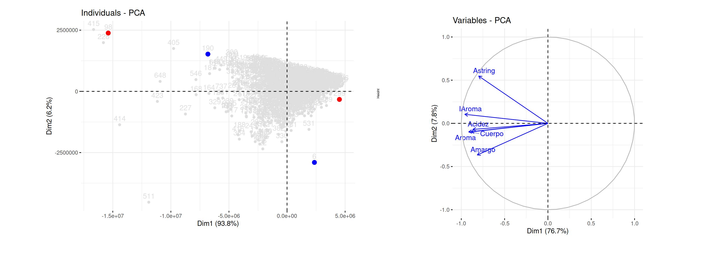

```{r setup, include=FALSE}
knitr::opts_chunk$set(echo = TRUE, comment = NA)

# colores
c1="#FF7F00"
c2="#=EB0C6"
c3="#034A94"
c4="#686868"

# devtools::install_github("kassambara/factoextra") # ultima version
library("factoextra") # visualizacion elegante en ggplot2
par(mar = c(1,1,1,1) + 0.1)
```

</br></br>


```{r, echo=FALSE, out.width="100%", fig.align = "center"}

```
</br></br>

# <span style="color:#034a94">**Introducción**</span>

</br>

Este análisis consiste en describir la variación producida por las observaciones de $p$ variables aleatorias, mediante un conjunto de nuevas variables que estan correlacionadas entre si, denominadas **componentes** y que estan conformadas por combinación lineal de las variables originales. 

Se utiliza como complemento de los análisis descriptivos y para contribución en modelos predictivos, reduciendo el número de variables empleadas en el modelo.

Las nuevas variables (llamadas componentes principales) se obtienen en orden de contribución a la variabilidad total de los datos, de tal forma que el primer componente describe la mayor cantidad de la variación total del conjunto de variables originales. El segundo componente principal se elige de tal forma que explique la mayor cantidad de la variación total del conjunto de datos que resta sin explicar por el primer componente, bajo la condición de ser independiente de la primera componente y así sucesivamente.

</br></br>

## <span style="color:#034a94">**Conceptos**</span>

<br/>

### **Matriz de datos** 
Los datos conforman una matriz de dimensión $n \times p$ que contiene los datos originales, donde $n$ corresponde al número de observaciones y $p$ el número de variables.

<br/>

### **Matriz de Varianzas-Covarianzas**  
Matriz cuadrada de dimensión $p \times p$ que contiene las covarianzas entre pares de variables  $Cov[X_i,X_j]$ y su diagonal está conformada por las varianza de las variables $V[X_i]$ 

<br/>

### **Autovalores y Autovectores** 
A parir de la matriz de varianza covarianzas son calculados sus valores propios que representan la cantidad de la varianza de la data explicada por cada componente principal,  mientras que los vectores propios de la misma matriz, indica la dirección y fuerza de la relación entre las variables y la de los componentes principales, 

Con ellos se determina el porcentaje de la varianza de los datos que son explicados por dada uno de los componentes principales los cuales tienen como condición la ortogonalidad entre ellos. Estadísticamente significa que son independientes unos de otros.

<br/>

### **Varianza explicada** 
Indica la cantidad de varianza en los datos originales que es explicada por cada componente principal. El total de la varianza explicada corresponde al 100% y abarca toda la varianza total de los datos originales.

Estos valores nos permiten evaluar la relevancia de cada uno de los componentes principales

<br/>

### **Carga de las variables**  
Indica la contribución de cada variable a cada componente principal. Dependiendo su valor puede sugerir un nombre para el componente que facilite la interpretación de los resultados obtenidos. Es decir que se trata de los diferentes pesos que tiene cada variables original como una convinación lineal. 

<br/>

### **Gráfico de dispersión**  
Representación visual de los datos transformados (componentes principales) en un nuevo espacio por lo general de $R^2$. Este gráfico permite identificar patrones o agrupaciones en los datos que pueden no haber sido evidentes en el espacio original de las variables.

<br/><br/>

Las componente se pueden representar por $CP1$, $CP2$, $CP3$ $\dots$ construidas a partir de un conjunto de $p$ variables, de forma que:

* $V[CP_1] > V[CP_2] > V[CP_3] > \dots > V[CP_p]$ y
* $Cor[CP_i, CP_j] = 0$ para todo para de componentes $i \neq j$

</br></br>

El objetivo principal del **ACP** es poder ver si las dos o tres primeras componentes explican la mayor parte de la variación de las $p$ variables iniciales. Si es así, se pueden considerar estas dos componentes, reduciendo la dimensión de los datos a $R^2$ y considerar su representación gráfica en el plano cartesiano.

</br></br>

<div class="content-box-gray">
### <span style="color:#686868">**Supuesto**</span> 

Las $p$ variables son una combinación lineal de un base que se desea encontrar.

</div>


<br/><br/>

## <span style="color:#034a94">**Los componentes principales**</span>


<br/>

El **primer componente** tiene la forma :

$$CP_{1}  = \beta_{11}X_1+ \beta_{12}X_2 + \dots + \beta_{1p}X_{p} = \displaystyle\sum_{i=1}^{p} \beta_{1i} X_{i} = b'_{1}X$$
</br>

Donde $b'= (\beta_{11}, \beta_{12}, \dots , \beta_{1p})$ es el vector de coeficientes a estimar y $X'$ el vector de variables $(X_1, X_2, \dots, X_p)$ que conforma la data.

<br/>

Para determinar la porción de la varianza total de la data explicada por el componente se define $\Sigma$ **matriz de Varianzas-covarianzas** , que está conformada por las varianzas de las variables originales en su diagonal principal y por fuera de ellas las covarianzas entre pares de variables.  

</br></br>

$$
\Sigma =
\begin{equation}
\left(
\begin{array}{cccc}
\sigma^2_1 & \sigma_{12} & \cdots & \sigma_{1p} \\
\sigma_{21} & \sigma^2_2 & \cdots & \sigma_{2p} \\
\vdots & \vdots & \ddots & \vdots \\
\sigma_{p1} & \sigma_{2p} & \cdots & \sigma^2_p
\end{array}
\right)
\end{equation}
$$

</br></br>

Enconces la varianza del primer componente será :

$$V[CP_1] = V[b'_1 X] = b'_1 \hspace{.1cm}\Sigma \hspace{.1cm} b_1$$
</br>

Bajo la restricción :

$$\beta_{11}^2  + \beta_{12}^2 + \dots + \beta_{1p} = b'_1 \hspace{.1cm}b_1= 1$$

</br>

La solución a este sistema se obtiene  mediante el método matemático **Multiplicadores de Lagrange** que maximiza el valor $\lambda_1$ para la siguiente función :

$$b'_1 \hspace{.1cm}\Sigma \hspace{.1cm}b_1 - \lambda_1 (b'_1 \hspace{.1cm} b_1-1) $$

</br>

Dando como resultados:

$$CP_1 = b'_1 X$$
</br>

El **segundo componenete** estará determinado por una segunda ecuación de Lagrange con la que se obtiene:


$$CP_2 = b'_2X$$

</br>

La varianza total de las $p$ variables está dada por :


$$\displaystyle\sum_{i=1}^p V[X_i] = \sum_{i=1}^p V[CP_i] = \displaystyle\sum_{i=1}^p \lambda_{i}$$
</br>

De tal forma que la contribución total por cada componente se estima como:


$$\dfrac{\lambda_{i}}{\displaystyle\sum_{i=1}^p \lambda_{i}}$$


</br>

Ahora, la contribución de los primeros tres componentes estará dado por :

$$\dfrac{\lambda_{1} + \lambda_2 + \lambda_3}{\displaystyle\sum_{i=1}^p \lambda_{i}}$$

</br></br>

Si los dos componentes principales explican un porcentaje grande de los datos nos permite representar los registros de la data en un plano cartesiano, pudiendo de esta forma identificar relaciones y patrones en los datos.

Para darle sentido al gráfico obtenido debemos se analizan los pesos del grupo de variables en la convinación lineal que conforma cada componente principal acompañado de la visualización de puntos extremos que ayudan a identificar sus principales caracteristicas


