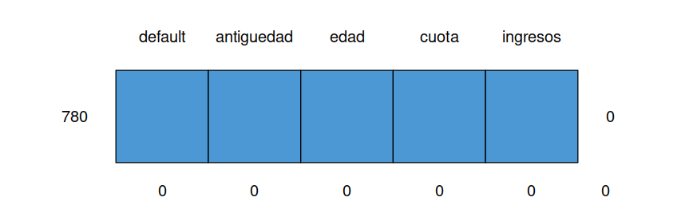

```{r setup, include=FALSE}
knitr::opts_chunk$set(echo = TRUE, comment = NA)

# colores
c1="#FF7F00"
c2="#=EB0C6"
c3="#034A94"
c4="#686868"

# devtools::install_github("kassambara/factoextra") # ultima version
library("factoextra") # visualizacion elegante en ggplot2
par(mar = c(1,1,1,1) + 0.1)

library(tidyverse)
library(paqueteMOD)
data("creditos") 
creditosZ= creditos[2:5] %>%
                 scale()
```

<br/>

La siguiente base de datos corresponde a información relacionada con el comportamiento crediticio de un grupo de 780 clientes de un banco

Se requiere resumir las variables cuantitativas (antiguedad, edad, cuota e ingresos) en por lo menos dos variables (componentes principales) y poder asi adicionar elementos al análisis 

<br/>

```{r, eval=FALSE}
library(paqueteMOD)
data("creditos")                # base de datos
creditosZ= scale(creditos)      # datos estandarizados

str(creditos)
```

<pre>
Show in New Window
tibble [780 × 5] (S3: tbl_df/tbl/data.frame)
 $ default   : num [1:780] 1 1 1 1 1 1 1 1 1 1 ...
 $ antiguedad: num [1:780] 37.32 37.32 30.98 9.73 8.44 ...
 $ edad      : num [1:780] 77 73.8 78.9 51.5 39 ...
 $ cuota     : num [1:780] 3020519 1766552 1673786 668479 1223559 ...
 $ ingresos  : num [1:780] 8155593 6181263 4328075 5290910 5333818 ...

</pre>

</br></br>

Inicialmente revisemos si existen datos faltantes

```{r, eval=FALSE}
library(mice)
md.pattern(creditos)
```


```{r, echo=FALSE, out.width="70%", fig.align = "center"}

```

La gráfica indica que no se presentan datos faltantes

<br/>

Con el fin de evitar que las variables que tiene una escala con valores más grandes afecten las estimaciones realizadas (sesgos) se realiza la estandarización de las variables antes de proceder a realizar el proceso de estimación de los componentes principales.


```{r, eval=FALSE}
library(tidyverse)
creditosZ= creditos[2:5] %>%
                 scale()
head(creditosZ) # primeros 6 registros
```

</br></br>

<pre>
       antiguedad         edad        cuota      ingresos
[1,]    1.6150493    1.5992045    2.8847306    1.05164674
[2,]    1.6150493    1.3426559    1.1906667    0.30723062
[3,]    1.0840529    1.7554121    1.0653432   -0.39150920
[4,]   -0.6957258   -0.4363146   -0.2927901   -0.02847471
[5,]   -0.8033479   -1.4406004    0.4571028   -0.01229636
[6,]   -0.9573230   -0.9680340    3.5564797   -1.00132277

</pre>


</br></br>

```{r, warning=FALSE, message=FALSE}
prcomp(creditosZ)
```

</br></br>

## <span style="color:#034a94">**Elección del número de componentes principales**</span>

</br>

```{r, fig.align='center'}
library(paqueteMOD)
data("creditos")
creditosZ= scale(creditos[,2:5]) 
res.pca <- prcomp(creditosZ)
fviz_eig(res.pca, addlabels = TRUE)
```

En este caso el primer componente principal explica el 55.9% de la variabilidad contenida en la base de datos y entre los dos primeros se casi el 80% de los datos (79.8), lo cual indicaría que con solo una variable (CP1) que se obtiene mediante una combinación lineal de las variables se puede resumir  gran parte de la variabilidad que contiene la base de datos.


</br></br>


```{r, fig.align='center'}
fviz_pca_var(res.pca,
             col.var = "contrib", # Color by contributions to the PC
             gradient.cols = c("#FF7F00",  "#034D94"),
             repel = TRUE     # Avoid text overlapping
             )
```

Al visualizar las variables en el plano de los componentes principales permite identificar el sentido y la caracterización de los componentes (caracteristica capturada por los vectores propios de $\Sigma$). En este ejercicio el primer componente principal está asociado principalmete con la variables **edad** y **antiguedad**, mientras que el segundo componente se puede asociar a la variable **cuota**


Para explicar el sentido de los ejes, se escogen cuatro casos extremos conformados por los siguientes clientes


```{r}
datos<- rbind(creditos[98,], # ok
              creditos[778,],
              creditos[6,],
              creditos[462,])

datos <- as.data.frame(datos)
rownames(datos) = c("Cliente 098","Cliente 778","Cliente 006","Cliente 462")
datos
```

</br></br>


```{r, fig.align='center'}

casos1 <- rbind(res.pca$x[98,1:2],res.pca$x[778,1:2]) # CP1
rownames(casos1) = c("98","299")
casos1 <- as.data.frame(casos1)

casos2 <- rbind(res.pca$x[6,1:2], res.pca$x[462,1:2]) # CP2
rownames(casos2) = c("6","190")
casos2 <- as.data.frame(casos2)

fviz_pca_ind(res.pca, col.ind = "#DEDEDE", gradient.cols = c("#00AFBB", "#E7B800", "#FC4E07")) +
  geom_point(data = casos1, aes(x = PC1, y = PC2), color = "red", size = 3) +
  geom_point(data = casos2, aes(x = PC1, y = PC2), color = "blue", size = 3)


 
```

</br></br>

<pre>

              default   antiguedad       edad     cuota   ingresos
Cliente 098         0    27.358904   74.30685    170024   20924813
Cliente 778         0     1.517808   26.61370      9256    2473929

Cliente 006         1     6.605479   44.87945   3517756    2710736
Cliente 462         0    26.380822   73.40548     69483    2335189
</pre>

</br></br>

El **cliente 098** presenta altos ingresos (\$20'924.813), mientras que el **cliente 778**  que se encuentra ubicado al otro extremo presenta bajos ingresos ( \$2'473.929). Esto muestra el sentido en que aumentan los valores del primer componente principal (Dim1).

</br>
Aun más dado que el primer componente no solo está conformado por la variable ingresos, sino que se trata de una combinación lineal de todas las variables donde se destaca (presenta mayor pesos) los ingresos se puede analizara que mientras el cliente 098 presenta una realción cuota/ingresos de \$170.024/\$20'924.813 = 0.008125473 , el cliente 299 que se encuentra al otro extremo de la recta presenta una relación \$727.995 / 848.487 = 0.8579919 .

</br>

Lo mismo ocurre al comparar el **clientes 006** (cuota = \$3'517.756) con **cliente190** (cuota = \$103.855)

</br></br>


```{r}
datos<- rbind(creditos[98,],
              creditos[293,],
              creditos[6,],
              creditos[190,])
datos
```


</br></br>

```{r, fig.align='center'}
fviz_pca_biplot(res.pca, 
                repel = TRUE,
                habillage = creditos$default,
                col.var = "#034A94", # Variables color
                col.ind = c("#DEDEDE", "#034A94")  # Individuals color
                )

```

<br/><br/>

La representación gráfica de los dos primeros componentes principales nos permite observar la relación existente entre las variables :  edad y antiguedad, formando un grupo que presenta un mayor efecto sobre el primer componente, mientras que la variable cuota presenta un mayor efecto sobre el segundo componente.


