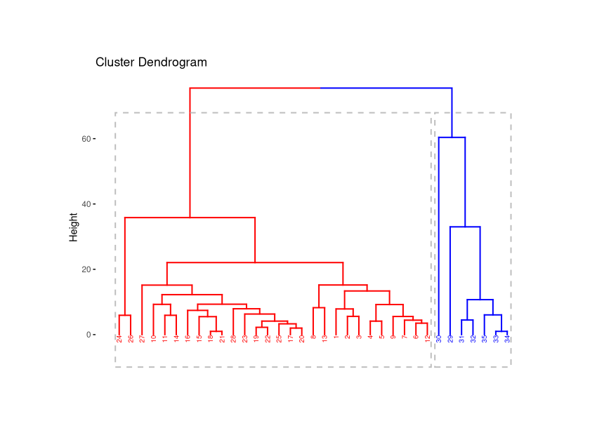

```{r setup, include=FALSE}
knitr::opts_chunk$set(echo = TRUE,comment = NA)
library(paqueteMODELOS)
library(ade4)
library(ggrepel)
library(xtable)
library(scatterplot3d)

id= 1:8
empresa =data.frame(inv.pub = c(16,12,10,12,45,50,45,50),
                     ventas =c(10,14,22,25,10,14,25,27) )
rownames(empresa) = c("E1","E2","E3","E4","E5","E6","E7", "E8")
empresa_z =scale(empresa)
empresa_z = as.data.frame(empresa_z)
```

<br/><br/>

# <span style="color:#FF7F00"> **Ejemplo**</span> 

</br>

Se tiene la información sobre la inversión en publicidad y las ventas  de 8 empresas

|id     | 1   | 2   | 3   | 4   | 5   | 6   | 7   | 8   |
|:------|:----|:----|:----|:----|:----|:----|:----|:----|
|inv.pub| 16  | 12  | 10  | 12  | 45  | 50  | 45  | 50  |
|ventas | 10  | 14  | 22  | 25  | 10  | 15  | 25  | 27  |


</br>

```{r}
id= 1:8
empresa =data.frame(inv.pub = c(16,12,10,12,45,50,45,50),
                     ventas =c(10,14,22,25,10,14,25,27) )
rownames(empresa) = c("E1","E2","E3","E4","E5","E6","E7", "E8")
```


</br>

Dado que los rangos de las variables son diferente y con fin de que estas diferencias en las dimensines de las variables no afecte los calculos de las distancias se aconseja estandarizar las variables (restar la media y dividir el resultado por la desviación estandar) antes de generar las calculos de las distancias

</br>

$$
z = \dfrac{\bar{x} - \mu}{\sigma}
$$
</br>


```{r}
empresa_z =scale(empresa)
empresa_z = as.data.frame(empresa_z)
empresa_z
```

</br>


Las distancias correspondientes a los valores estandarizados serán:

</br></br>

### <span style="color:#034a94">**Distancias euclidianas**</span>

```{r}
dist(empresa_z, method = "euclidean")
```
</br></br>

#### <span style="color:#034a94">**Distamcias de Manhattan**</span>

```{r}
dist(empresa_z, method = "manhattan")
```

</br></br>

#### <span style="color:#034a94">**Distancias de Minkowski**</span>


```{r}
dist(empresa_z, method = "minkowski")
```

</br></br>

### <span style="color:#034a94">**Distribución de los individuos por distancias**

```{r, message=FALSE, warning=FALSE}
library(tidyverse)
# distancia euclidiana
dist_emp <- dist(empresa_z, method = 'euclidean')

# Cluster jerarquico con el método complete
hc_emp <- hclust(dist_emp, method = 'complete')

# Determinamos a dónde pertenece cada observación
cluster_assigments <- cutree(hc_emp, k = 4)

# asignamos los clusters
assigned_cluster <- empresa_z %>% mutate(cluster = as.factor(cluster_assigments))


# gráfico de puntos
ggplot(assigned_cluster, aes(x = inv.pub, y = ventas, color = cluster)) +
  geom_point(size=4) + 
    theme_classic()
```

</br></br>


```{r}
plot(hc_emp, cex = 0.6, main = "Dendograma de Empresas",
     ylab = "Distancia euclidiana", xlab = "Grupos")
rect.hclust(hc_emp, k = 2, border = 2:5)
```

</br></br>

En este diagrama se observa que al inicio los individuos que más se parecen (menor distancia euclidea) son los individuos `E7`, `E8`, `E3`, `E4` ( `d(E7, E8) = 0.3863837`), `d(E3, E4) = 0.4350355`, conformando estas cuatro empresas un primer cluster y el resto un segundo grupo o cluster a una distancia de 2.5.

En el caso de tener hipótesis de la existencia de de 4 grupos podemos reducir la distancia 1.0 y se obtienen cuarto conglomerados

</br>

```{r}
plot(hc_emp, cex = 0.6, main = "Dendograma de Empresas",
     ylab = "Distancia euclidiana", xlab = "Grupos")
rect.hclust(hc_emp, k = 4, border = 2:5)
```

</br></br>


### <span style="color:#034a94">**Clasificación de las empresas**</span>

```{r}
dendograma <- hclust(dist_emp, method = "average")
grp <- cutree(dendograma, k = 4)
grp
```


</br></br>


### <span style="color:#034a94">**Elección del número de conglomerados**</span>

</br>

Elegir el número óptimo de clusters o grupos  es una decisión subjetiva, sin embargo puede tomarse el criterio del mayor salto de nodo a nodo de las distancias euclidianas: Observando el dendograma vemos que el mayor incremento de las distancias se dio en $1$, por lo que si trazamos una linea se hará un corte y tendremos cuatros nodos, el conformado por $(E1,E2)$, $(E5, E6)$, $(E7, E8)$ y $(E3, E4)$. 

</br>

```{r message = FALSE}
library(factoextra)

dist_emp <- dist(empresa_z, method = "euclidean")
dendograma <- hclust(dist_emp, method = "average")
# plot(dendograma, cex = 0.6, hang = -1) 
barplot(sort(dendograma$height, decreasing = TRUE), horiz = TRUE, 
        main = "Agregaciones (distancias euclidianas)",
        col = "lightblue", ylab = "Nodo", xlab = "Peso", xlim = c(0, 2.5))
```

<!-- ```{r} -->
<!-- dist_euclidianas =c( -->
<!-- 0.6011686,                                                             -->
<!-- 1.7174126, 1.1301375,                                                   -->
<!-- 2.1202905, 1.5470942, 0.4350355,                                         -->
<!-- 1.5363805, 1.8365815, 2.5073323, 2.7399379,                               -->
<!-- 1.8870832, 2.0131883, 2.3993252, 2.5389816, 0.6218234,                     -->
<!-- 2.6098255, 2.3345313, 1.9016521, 1.7482951, 2.1096739, 1.5696079,           -->
<!-- 2.9935422, 2.7195432, 2.2327792, 2.0327447, 2.4055927, 1.8283841, 0.3863837) -->

<!-- sort(dist_euclidianas) -->
<!-- dist_euclidianas[2:28]-dist_euclidianas[1:27] -->
<!-- ``` -->


Por último se mide el `indice de Silhouette` promedio con el fin de valorar la mejor alternativa para la elección del número de conglomerados


```{r , warning=FALSE,message=FALSE}

library(tidyverse)
library(cluster)
# distancia euclidiana
dist_emp <- dist(empresa_z, method = 'euclidean')

# Cluster jerarquico con el método complete
hc_emp <- hclust(dist_emp, method = 'complete')

# Determinamos a dónde pertenece cada observación
cluster_assigments <- cutree(hc_emp, k = 4)

# Calcular el coeficiente de Silhouette
sil <- silhouette(cluster_assigments, dist(empresa_z))
sil_avg <- mean(sil[,3])

# Imprimir el coeficiente de Silhouette promedio
cat("Coeficiente de Silhouette promedio k=4 : ", sil_avg)

```

</br></br>

```{r , warning=FALSE,message=FALSE}

library(tidyverse)
library(cluster)
# distancia euclidiana
dist_emp <- dist(empresa_z, method = 'euclidean')

# Cluster jerarquico con el método complete
hc_emp <- hclust(dist_emp, method = 'complete')

# Determinamos a dónde pertenece cada observación
cluster_assigments <- cutree(hc_emp, k = 2)

# Calcular el coeficiente de Silhouette
sil <- silhouette(cluster_assigments, dist(empresa_z))
sil_avg <- mean(sil[,3])

# Imprimir el coeficiente de Silhouette promedio
cat("Coeficiente de Silhouette promedio k=2 : ", sil_avg)

```

<br/>

Estos resultados indican una mejor agrupación cuando se eligen `k=4` conglomerados. (valores más cercanos a 1 indican un agrupamiento más coherente)

</br></br></br>

### <span style="color:#FF7F00"> **Ejemplo**</span> 

</br>

El siguiente ejemplo  en **R** cuenta con  un conjunto de datos sobre $35$ observaciones de `whiskys`, que contiene las variable `precio`, `proporción de alcohol`, `años de añejo` y la `nota` que le da el jurado a la calidad de estos.

</br></br>

```{r, message = FALSE}
data("whisky")
#data = read.table("whisky.txt", header = TRUE, row.names = 1)
tail(whisky)
```

</br></br>

Mediante la libreria *factoextra* podemos calcular las distancias euclidianas de los individuos y gráficar el dendograma del conjunto de datos:

</br>

```{r message = FALSE}
library(factoextra)
distancias <- dist(whisky, method = "euclidean")
dendograma <- hclust(distancias, method = "average")
# plot(dendograma, cex = 0.6, hang = -1, main= "Dendograma") 
barplot(sort(dendograma$height, decreasing = TRUE), horiz = TRUE, 
        main = "Agregaciones (distancias euclidianas)",
        col = "lightblue", ylab = "Nodo", xlab = "Peso", xlim = c(0, 80))
```

</br></br>

Podemos observar que el mayor salto en las agregaciones se da en 60.38, por lo que se puede realizar un corte con este valor en el dendograma, quedando:

</br>

```{r eval= FALSE}
fviz_dend(dendograma, k=2, cex = 0.5,
          k_colors = c("red",  "blue"), 
          color_labels_by_k = TRUE, 
          rect=TRUE,
          main = "Dendograma")
```

</br></br>

```{r, echo=FALSE, out.width="80%", fig.align = "center"}
# 
```

</br>

En este caso el número optimo de grupos o clusters será de 2. Con el siguiente código podemos ver en la primera fila los individuos y en la segunda los clusters a los que estos pertenecen.


</br></br>

```{r}
grp <- cutree(dendograma, k = 2)
grp
```


</br></br>

La libreria `FactoClass` para representar los clusters en el primer plano factorial, en la función `FactoClass` tenemos los siguientes argumentos: 

</br></br>

* `nf`: número de componentes principales, recordemos que en el acp este será igual al número de variables. <br>

* `nfcl`: número de componentes usadas para clasificación, en este caso será igual a` nf=p`. <br>

* `k.clust`: número de clusters, en este caso mediante el dendograma elegimos dos clusters. 

</br></br>

```{r message = FALSE}
# library(FactoClass)
# p = ncol(data)
# Cluster <- FactoClass(whisky, dudi.pca, nf = p, nfcl = p, k.clust = 2, scanFC = FALSE)
```

</br></br>

```{r,eval=FALSE}
library(FactoClass)
plotFactoClass(Cluster,title="Análisis de conglomerados")
```

</br></br>

```{r, echo=FALSE, out.width="80%", fig.align = "center"}
knitr::include_graphics("img/cluster1.png")
```

</br></br>

<!-- A partir de ahora podemos realizar el análisis que hicimos anteriormente en un ACP, podemos observar que en el primer plano factorial se representa el $75.99$\% de la varianza total, quedando un $24.01$\% sin explicar mediante las dos primeras componentes. Se evidencia que el cluster 2 se caracteriza por tener porcentaje altos de alcohol, altos precios y mayores años de añejo, por otra parte el cluster 1 se caracteriza por tener precios mucho más economicos a costa de tener menor porcentaje de alcohol y pocos años de añejo. -->

