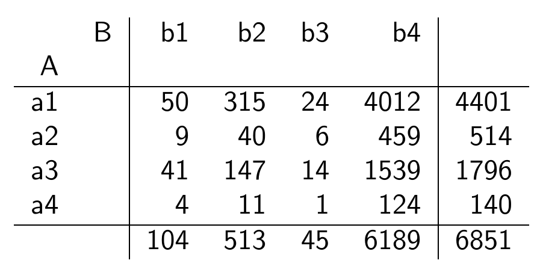

```{r setup, include=FALSE}
knitr::opts_chunk$set(echo = TRUE, comment = NA)
```

</br>

El Análisis de Correspondencia es un método estadístico utilizado para representar posibles asociaciones entre  variables categóricas, es decir la asociación entre sus cagarías, con el fin establecer si existe, patrones o estructuras en los datos 

</br>

Este método estadístico es de tipo exploratorio y complementario de otros tipos de análisis como los modelos de regresión logístico.

</br>

La creación de esta herramienta estadística se le atribuye al matemático y estadístico francés  Jean-Paul Benzécri al final de la década de los noventa. A lo largo del tiempo este método se ha empleado por varios campos del conocimiento con diversos nombres como : Escalonamiento óptimo, Análisis canónico, Método de los promedios recíprocos, Puntuaciones aditivas, Puntuaciones apropiadas, Ponderaciones de Guttman, Teoría de cuantificación de Hayashi, Regresión lineal simultánea, Análisis factorial de correspondencia, Biplot, Escalado dual.

</br>

Iniciaremos la explicación del método asociándolo con el caso de dos variables A y B y un test de independencia para tablas de contingencia chi-cuadrado, la cual consiste en obtener el estadístico de prueba mediante la sumatoria de  la razón de las diferencias al cuadrado de los valores esperados y los valores observados y los valores observados, llamada también distancia de Pearson  :

</br></br>

$$\lambda = \sum_{i=1}^{m} \sum_{j=1}^{n} \dfrac{(n_{ij} - n_{i.} n_{.j}/n)^2}{n_{i.}n_{.j}/n}$$
</br>

Donde 

<center>
{width=50%}
</center>

</br></br>


Supongamos que tenemos la siguiente tabla de contingencia, como resultado de una  encuesta que contenía dos preguntas: su actividad laboral y si habían sufrido o no de alguna enfermedad relacionadas con el estrés. 


<center>
{width=28%}
</center>

</br></br>

Con esta información podremos obtener una métrica que nos permita agrupar las profesiones conformando grupos semejantes


<center>
{width=30%}
</center>

</br></br>

<center>

{width=80%}
</center>

</br></br>

La representación gráfica de estos valores permite visualizar que podrían existir tres grupos en cuanto a enfermedades relacionadas con el estrés :

* Empleado público, empleado estatal y ama de casa
* Docente
* Empleado bancario

</br></br>

## <span style="color:#034a94">**Análisis de correspondencia simple**</span>

</br>

Ahora utilicemos la métrica $\lambda$ de Pearson para identificar si existe asociación entre las variables $A$ y $B$. Para ello se parte de una tabla cruzada o de doble entrada donde se visializan las frecuencias conjuntas para todas las combinaciones posibles entre las categorías de ambas variables.

</br></br>

<center>

{width=40%}
</center>

```{r, warning=FALSE, message=FALSE}
library(tidyr)
m <- c(50,9,41,4,315,40,147,11,24,6,14,1,4012,459,1539,124) %>%
matrix(., ncol=4) 
colnames(m) <- c( "b1", "b2", "b3", "b4")
rownames(m) <- c( "a1", "a2", "a3", "a4")
m
```

</br></br>

Mediante la prueba chi.cuadrado se obtienen dos matrices con las que posteriormente se construirán las coordenadas que serán representadas en un plano cartesiano para permitir ver la cercania o no entre las categorias de ambas variables


```{r, warning=FALSE}
chisq.test(m)
```

</br></br>

Los resultados de la prueba indican que las variables **A** y **B** no son independientes y que por tanto existen relaciones entre sus categorías. 

</br></br>

Iniciaremos visualizando la matriz de valores observados 

```{r, warning=FALSE}
chisq.test(m)$observed
```


Y la matriz de valores esperados. Estos valores corresponde a los valores esperados en caso de que se cumpla la hipótesis nula que afirma que las dos variables son independientes haciendo que se cumpla que :


$$n_{11} = \dfrac{n_{.1} \times n_{1.} }{n} = \dfrac{4401 \times 104}{6796} = 67.34903$$


```{r, warning=FALSE}
chisq.test(m)$expected
```

A partir de los valores observados y los valores esperados se calcula la matriz de discrepancias 

$$ d_{11} = \dfrac{(50-67.349029)^2}{67.349029} = 4.469089$$


```{r, warning=FALSE}
Obs <- chisq.test(m)$observed
Esp <- chisq.test(m)$expected
Discrepancias <- (Obs-Esp)^2/Esp
Discrepancias
```

</br></br>

La suma total de los valores de la matriz de discrepancias constituye el valor del esta disco chi-cuadrado ($\lambda = 21.359$)


```{r}
sum(Discrepancias)
```


</br></br>

Ahora fijaremos como propósito determinar las **coordenadas** para cada una de las clases de las dos variables (a1,a2,a3,a4,b1,b2,b3 y b4) a partir de la matriz de discrepancias que llamaremos **C**. Para ello se debe realizar la factorización de la matriz **C** como .


$$C = U \hspace{.2cm} D \hspace{.2cm} V^{t}$$


```{r}
C <- Discrepancias
U <- eigen(C%*%t(C))$vectors
U
```


```{r}
V <- eigen(t(C) %*% C)$vectors
V
```


```{r}
a <- sqrt(eigen(C%*%t(C))$values)
a
```


```{r}
D <- diag(a)
D
```


```{r}
-U%*%D%*%t(V)
C
```

```{r}
udvt=svd(Discrepancias)
U <-udvt$u
D <-udvt$d
V <-udvt$v
```

```{r}
U
```

```{r}
D
```

```{r}
V
```

```{r}
coord_filas <- U %*% sqrt(D)
coord_filas
```


```{r}
coord_columnas <- t(V) %*% sqrt(D)
coord_columnas
```

Finalmente se representa los resultados obtenidos en un plano cartesiano donde se pueden visualizar las relaciones entre las categorías de las dos variables

</br></br> 

**Porcentaje de varianza explicado**

</br>

Con el fin de establecer el porcentaje explicado por los dos primeros ejes, llamados componentes o tambien dimensiones a tener en cuenta dentro del análisis se calculan los valores propios de la matriz obtenida en el análisis de correspondencia


```{r}
library(ade4)
library(FactoMineR)
library(factoextra)
library(gridExtra)
res.ac <- CA(tabla)
valores_prop <-res.ac$eig 
```

