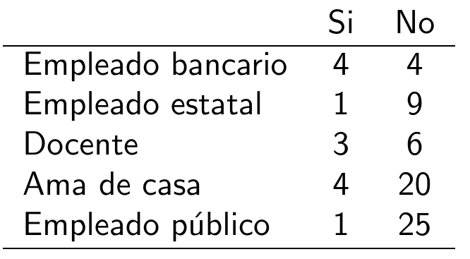

```{r setup, include=FALSE}
knitr::opts_chunk$set(echo = TRUE)
```

</br>

El Análisis de Corespondencia es un método estadístico utilizado para representar posibles asociaciones entre  variables categóticas, es decir la asociación entre sus cagorías, con el fin establecer si existe, patromes o estructuras en los datos 

</br>

Este método estadístico es de tipo exploratorio y complementario de otros tipos de análisis como los modelos de regresión logistico.

</br>

La creación de esta herramienta estadistica se le atribulle al matemático y estadíostico francés  Jean-Paul Benzécri al final de la décade de los noventa. A lo largo del tiempo este método se ha empleado por varios campos del conocimiento con diversos nombres como : Escalonamiento óptimo, Análisis canónico, Método de los promedios recíprocos, Puntuaciones aditivas, Puntuaciones apropiadas, Ponderaciones de Guttman, Teoria de cuantificación de Hayashi, Regresión lineal simultánea, Análisis factorial de correspondencia, Biplot, Escalado dual.

</br>

Iniciaremos la explicación del método asociandolo con el caso de dos variables A y B y un test de independencia para tablas de contingencia chi-cuadrado, la cual consiste en obtener el estadístico de prueba mediente la sumatoria de  la razón de las diferencias al cuadrado de los valores esperados y los valores observados y los valores observados, llamada tambien distancia de Pearson  :

</br></br>

$$\lambda = \sum_{i=1}^{m} \sum_{j=1}^{n} \dfrac{(n_{ij} - n_{i.} n_{.j}/n)^2}{n_{i.}n_{.j}/n}$$
</br>

Donde 

<center>
{width=60%}
</center>

</br></br>


Supongamos que tenemos la siguiente tabla de contingencia, como resultado de una  encuesta que contenia dos preguntas: su actividad laboral y si habian sufrido o no de alguna enfermedad relacionadas con el estrés. 


<center>
{width=35%}
</center>

Con esta información podremos obtener una metrica que nos permita agrupar las profesiones conformando grupos semejantes


<center>
{width=35%}
</center>

</br></br>

<center>

{width=100%}
</center>

La representación gráfica de estos valores permite visualizar que podrían existir tres grupos en cuanto a enfermedades relacionadas con el estrés :

* Empleado público, empreado estatal y ama de casa
* Docente
* Empleado bancario


Ahora utilicemos la metrica $\lambda$ de Pearson para identificar si existe asociacion entre las variables $A$ y $B$


</br></br>

<center>

{width=50%}
</center>

```{r}
library(tidyr)
m <- c(50,9,41,4,315,40,147,11,24,6,14,1,4012,459,1539,124) %>%
      matrix(., ncol=4) 
colnames(m) <- c( "b1", "b2", "b3", "b4")
rownames(m) <- c( "a1", "a2", "a3", "a4")
m
```

```{r, warning=FALSE}
chisq.test(m)
```

```{r, warning=FALSE}
```


```{r, warning=FALSE}
chisq.test(m)$observed
```


```{r, warning=FALSE}
chisq.test(m)$expected
```


```{r, warning=FALSE}
Obs <- chisq.test(m)$observed
Esp <- chisq.test(m)$expected
Discrepancias <- (Obs-Esp)^2/Esp
Discrepancias
```


```{r}
sum(Discrepancias)
```

Ahora fijaremos como propósito determinar dos coordenadas para cada una de las clases de las dos variables (a1,a2,a3,a4,b1,b2,b3 y b4) a partir de la matriz de discrepancias que llamaremos **C**.

Podemos factorizar esta matriz como :

$$C = U \hspace{.2cm} D \hspace{.2cm} V^{t}$$


```{r}
C <- Discrepancias
U <- eigen(C%*%t(C))$vectors
U
```


```{r}
V <- eigen(t(C) %*% C)$vectors
V
```


```{r}
a <- sqrt(eigen(C%*%t(C))$values)
a
```


```{r}
D <- diag(a)
D
```


```{r}
-U%*%D%*%t(V)
C
```

```{r}
udvt=svd(Discrepancias)
U <-udvt$u
D <-udvt$d
V <-udvt$v
```

```{r}
U
```

```{r}
D
```

```{r}
V
```

```{r}
coord_filas <- U %*% sqrt(D)
coord_filas
```


```{r}
coord_columnas <- t(V) %*% sqrt(D)
coord_columnas
```

