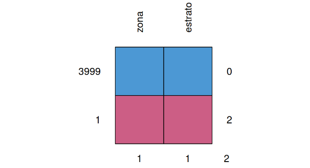

```{r setup, include=FALSE}
knitr::opts_chunk$set(echo = TRUE, comment = NA)
library(dplyr)
library(readr)
library(paqueteMODELOS)
data(vivienda)
#vivienda <- read_csv("~/Documentos/Javeriana/Ms Ciencia de Datos/recursos/data/vivienda.csv")
vivienda24 <- vivienda[, c(2,4)]
```

<br/>

Para ilustrar los pasos para realizar un análisis de correspondencia se toma una muestra de la base de datos vivienda contenida en paqueteMOD

<br/>

* Se toma una muestra de tamaño n=4000 de la base de datos `vivienda24` contenida en `paqueteMOD`


```{r} 
set.seed(1234)
vivienda.24 <- sample_n(vivienda24, 4000)
```

* Se convierte en variable tipo factor la variable `vivienda$estrato`

```{r, eval=FALSE} 
vivienda.24$estrato <- as.factor(vivienda.24$estrato)
```

<br/><br/>

* Se revisa si la base tiene datos faltantes (rectangulos de color rojo)

```{r, eval=FALSE}
library(mice)
md.pattern(vivienda.24, rotate.names = TRUE)

```

```{r, echo=FALSE, out.width="50%", fig.align = "center"}

```


<br/>

La muestra seleccionada contiene un registro con datos faltantes para ambas variables, de tal forma que se procede a eliminarlas, para posteriormente constatar que se han eliminado se utiliza la función  md.pattern del paquete mice

<br/>

```{r, eval=FALSE}
library(mice)
vivienda.24 <- na.omit(vivienda.24)
grafico <-md.pattern(vivienda.24, rotate.names = TRUE)
```


```{r, echo=FALSE, out.width="60%", fig.align = "center"}

```


<br/>

Se construye entonces una tabla cruzada con las variables involucradas en el análisis : 

* Zona    : Centro, Norte, Oeste, Oriente, Sur
* Estrato : 3,4,5,6

<br/>

```{r, warning=FALSE, message=FALSE}
library(FactoMineR)
tabla <- table(vivienda.24$zona, vivienda.24$estrato)
colnames(tabla) <- c("Estrato3", "Estrato4", "Estrato5", "Estrato6" )
tabla
```

<br/>


```{r}
chisq.test(tabla)
```

<br/>

El resultado indica que se rechaza la hipótesis de independencia de las variables (p-value: 0.0000), indicando grado tipo de relación entre ellas.

<br/>

Finalmente se procede a realizar el análisis de correspondencia que consistes en estimar las coordenadas para cada uno de los niveles de ambas variables y representarlas en un plano cartesiano

<br/>

```{r, warning=FALSE, message=FALSE}
library(FactoMineR)
library(factoextra)
library(gridExtra)
resultados_ac <- CA(tabla)
```

<br/>

El gráfico nos permite establecer relaciones y validarlas como son:

* El estrato 6 se encuentra ubicado en la Zona Oeste
* Los estratos 4 y 5 están ubicados principalmente en la Zona Sur y Norte
* El estrato 3 está presente en las Zonas Oriente y Centro


<br/><br/>

Para medir el grado de representatividad del proceso calculas los valores de la varianza acumulada, utilizando para ellos los valores propios de la matriz de discrepancias


```{r}
valores_prop <-resultados_ac$eig ; valores_prop

```


```{r}
fviz_screeplot(resultados_ac, addlabels = TRUE, ylim = c(0, 80))+ggtitle("")+
  ylab("Porcentaje de varianza explicado") + xlab("Ejes")
```

Los resultados indican que la primera componente resumen el 68.9% y los dos primeros componentes prepresentados en el plano factorial, mientras que los dos primeros ejes resumen un 96.4% de los datos.


<br/><br/>


### **Código**

```{r, eval=FALSE}

library(paqueteMODELOS)
data(vivienda)
vivienda.24 <- vivienda[, c(2,4)]

library(dplyr)
set.seed(1234)
vivienda.24 <- sample_n(vivienda.24, 4000) 
md.pattern(vivienda.24, rotate.names = TRUE)

library(mice)
library(FactoMineR)
vivienda.24 <- na.omit(vivienda.24)
tabla <- table(vivienda.24$zona, vivienda.24$estrato)
resultados_ac <- CA(tabla)
valores_prop <-resultados_ac$eig 

library(factoextra)
fviz_screeplot(resultados_ac, addlabels = TRUE, ylim = c(0, 80))+ggtitle("")+
  ylab("Porcentaje de varianza explicado") + xlab("Ejes")
```


<pre>

library(paqueteMODELOS)
data(vivienda)
vivienda.24 <- vivienda[, c(2,4)]

library(dplyr)
set.seed(1234)
vivienda.24 <- sample_n(vivienda.24, 4000) 
md.pattern(vivienda.24, rotate.names = TRUE)

library(mice)
library(FactoMineR)
vivienda.24 <- na.omit(vivienda.24)
tabla <- table(vivienda.24$zona, vivienda.24$estrato)
resultados_ac <- CA(tabla)
valores_prop <-resultados.ac$eig 

library(factoextra)
fviz_screeplot(resultados_ac, addlabels = TRUE, ylim = c(0, 80))+ggtitle("")+
  ylab("Porcentaje de varianza explicado") + xlab("Ejes")

</pre>

<br/><br/>

<div class="content-box-yellow">
### <span style="color:#034A94">**Reto**</span> 

Para la variables contenidas en la base de datos `rotacion` de `paqueteMODELOS`, determine la asociación que puede existir entre los niveles de las siguientes:

* Educacion - Departamento
* Satisfacción laboral - Equilibrio Trabajo-Vida


```{r, eval=FALSE}
library(paqueteMODELOS)
data(rotacion)

```
</div>


